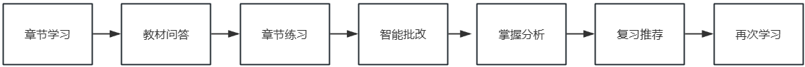
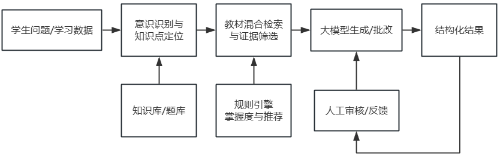
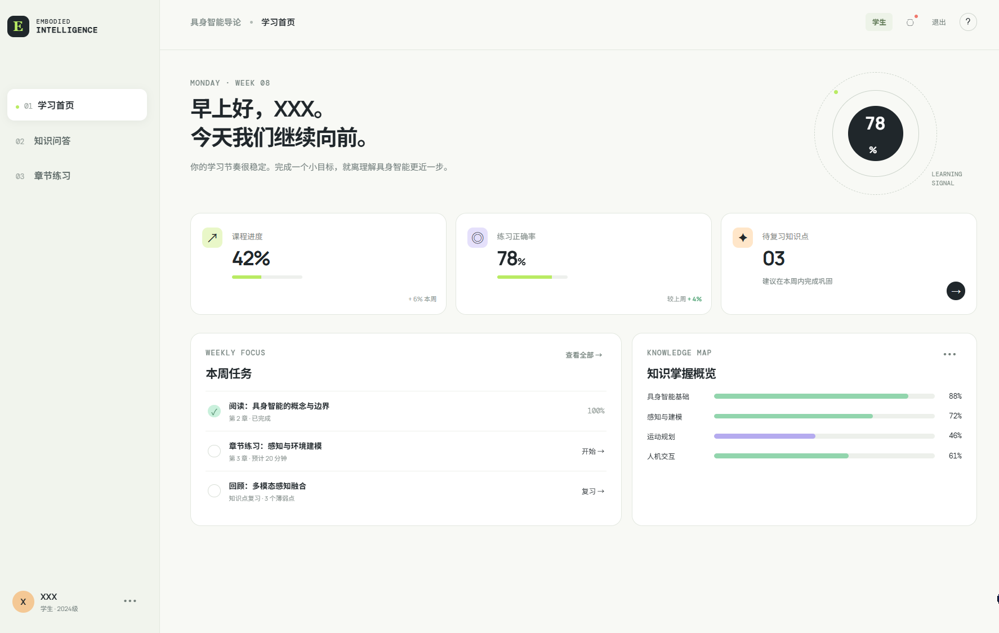
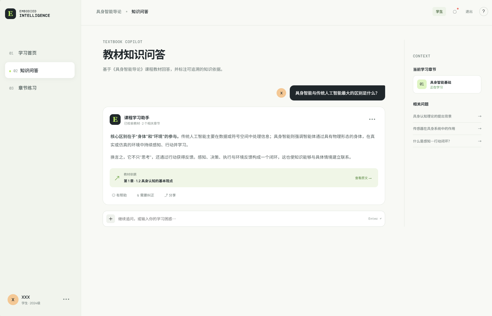
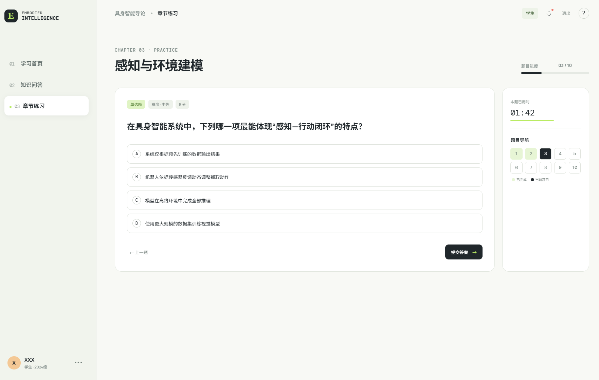
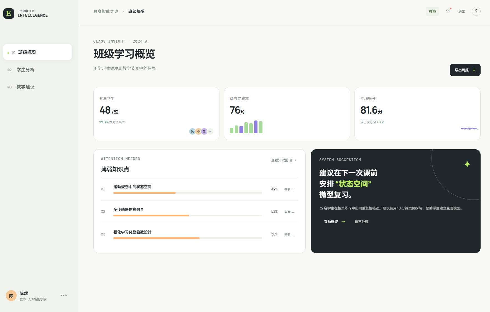
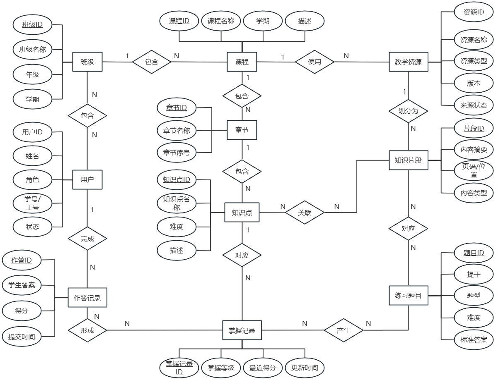

# “具身智能”课程教学智能体

**产品需求文档 PRD v0.1**

| 项目项 | 内容 |
| --- | --- |
| 项目名称 | “具身智能”课程教学智能体 |
| 文档版本 | PRD v0.1 |
| 交付阶段 | MVP 初稿 |
| 文档状态 | 可评审 / 可迭代 |
| 编写日期 | 2026 年 7 月 20 日 |
| 项目成员 | 李斌（组长）、张恒、樊倩倩 |

## 0. 文档信息

| 版本 | 日期 | 状态 | 变更内容 |
| --- | --- | --- | --- |
| v0.1 | 2026-07-20 | 初稿 | 完成产品目标、核心流程、原型、数据库设计、Prompt 初稿、验收标准与成员分工。 |

### 0.1 文档目的

本文档用于统一项目成员对“本期要做什么、为什么做、如何实现以及做到什么程度算完成”的认识，并作为产品原型、系统开发、知识库建设、测试验收和项目汇报的共同依据。

### 0.2 目录

| 章节 | 主要内容 |
| --- | --- |
| 1 | 项目背景与问题 |
| 2 | 产品目标与成功标准 |
| 3 | 范围边界与优先级 |
| 4 | 用户角色与权限 |
| 5 | 核心业务流程 |
| 6 | 功能需求 |
| 7 | 产品原型 |
| 8 | AI 能力与 Prompt 初稿 |
| 9 | 数据库设计 |
| 10 | 非功能需求 |
| 11 | 验收与测试 |
| 12 | 项目计划与风险 |
| 13 | 成员分工 |

## 1. 项目背景与问题

### 1.1 项目背景

具身智能课程涉及环境感知、任务规划、运动控制、机器人执行、多智能体协同和安全伦理等内容。课程专业概念多、知识关联性强，学生在自主学习时容易出现概念理解困难、知识衔接不清、练习针对性不足以及缺少及时反馈等问题。

传统教材能够提供系统知识，但难以根据不同学生的学习基础、提问记录和作答情况提供个性化支持。教师也难以及时掌握班级整体的知识薄弱点和学生个体的学习进度。

### 1.2 目标用户与核心痛点

| 用户 | 典型场景 | 主要痛点 |
| --- | --- | --- |
| 学生 | 课前预习、课堂复习、章节练习、考试前巩固 | 遇到问题无法及时获得有依据的讲解；不知道先学什么、复习什么；做题后只有分数，缺少错误原因和后续建议。 |
| 教师 | 资源维护、题目发布、学情分析、教学调整 | 难以汇总学生高频问题、共性错题和章节掌握情况；教学调整缺少连续数据支撑。 |
| 管理员 | 用户、班级、课程和系统配置 | 需要统一管理角色权限、课程资源、日志和系统运行状态。 |

### 1.3 产品机会

本项目通过 RAG 教材知识库、大语言模型和规则化学习分析，将教材问答、练习训练、智能批改、薄弱点识别、复习推荐和教师学情分析连接起来，形成“学生持续学习”和“教师持续改进”两条业务闭环。

## 2. 产品目标与成功标准

### 2.1 产品定位

建设一套面向具身智能课程的教学辅助智能体。系统不是替代教师，而是为学生提供可信、及时、可追溯的学习支持，并为教师提供可解释的学情统计和教学参考。

### 2.2 本期产品目标

- 建设与课程章节和知识点相对应的教材知识库，支持教材、课件和实验指导书导入。
- 提供带有资料名称和章节等来源信息的课程问答与辅助讲解。
- 支持按章节、知识点、题型和难度生成基础练习，并完成自动批改与解析。
- 基于学习记录和作答结果识别薄弱知识点，推荐复习内容或后续知识点。
- 为教师提供个人和班级层面的学习进度、正确率、高频问题和薄弱点统计。

### 2.3 可衡量的成功标准

| 指标 | v0.1 / MVP 目标 |
| --- | --- |
| 核心流程 | 教材导入—问答—练习—批改—掌握分析—推荐—教师统计能够完整演示。 |
| 来源溯源 | 已入库问题的回答能够展示资料名称与章节。 |
| 问答可用性 | 人工评测集中不少于 80% 的常见课程问题回答可用，且无依据时不伪造出处。 |
| 练习可用性 | 生成题目包含题干、答案、解析、知识点和来源；教师可审核后发布。 |
| 角色权限 | 学生仅查看本人数据；教师仅查看负责班级；管理员管理课程与账号。 |
| 数据闭环 | 问答、作答和推荐结果可记录，并能进入个人/班级统计。 |

## 3. 范围边界与优先级

### 3.1 本期范围

| 优先级 | 功能范围 | 处理原则 |
| --- | --- | --- |
| P0 | 教材资源导入、RAG 问答与溯源、章节练习、智能批改、掌握分析、学习推荐、教师班级统计、基础权限 | 必须实现，缺失时无法形成核心教学闭环。 |
| P1 | 个人学习报告、题目审核发布、学生反馈纠错、教师教学建议、数据导出、日志查看 | 在 P0 稳定后完成，可根据项目周期适当调整。 |

### 3.2 本期不做

- 不训练或微调专用大模型，优先使用现有模型配合 Prompt、RAG 和规则约束。
- 不直接控制真实机器人或仿真平台执行任务。
- 不将系统掌握等级直接作为课程正式成绩。
- 不自动替代教师发布正式题目和作出最终教学决策。

## 4. 用户角色与权限

| 角色 | 主要目标 | 可使用功能 | 数据范围 |
| --- | --- | --- | --- |
| 学生 | 完成学习、提问、练习并获得反馈 | 教材问答、章节练习、查看批改、复习推荐、个人报告 | 仅本人学习数据和已开放课程内容 |
| 教师 | 维护资源、组织练习、掌握学情并调整教学 | 资源管理、题目审核发布、学生分析、班级分析、教学建议 | 所负责课程和班级数据 |
| 管理员 | 保障课程、用户和系统正常运行 | 用户班级管理、角色权限、课程配置、日志和异常查看 | 系统配置及授权范围内全部数据 |

## 5. 核心业务流程

### 5.1 学生学习闭环



图 1  学生学习闭环

学生从章节学习开始，通过教材问答解决理解问题；完成学习后生成章节练习，系统批改并分析知识点掌握情况。对于薄弱知识点，系统推荐对应教材位置和补充练习；达到基本掌握后，推荐进入下一知识点。

### 5.2 教师教学闭环


图 2  教师教学闭环

系统汇总学生的问答、作答和学习进度，形成个人及班级统计。教师根据低正确率知识点、高频问题和学习进度差异调整讲解或练习，系统继续记录调整后的学习结果，以便对比教学改进效果。

### 5.3 AI 核心工作流



图 3  AI 核心工作流

系统将确定性功能与概率性 AI 能力分开处理。权限、状态、记录和阈值判断采用规则；问答生成、题目生成、简答题批改和教学建议由大模型完成，并通过知识库证据、结构化输出、人工审核和失败降级提高稳定性。

## 6. 功能需求

### 6.1 学生端功能

| 编号 | 功能 | 触发与处理 | 主要输出 | 优先级 |
| --- | --- | --- | --- | --- |
| STU-01 | 教材知识问答 | 学生输入课程问题，系统识别章节和知识点，检索教材片段后生成回答。 | 回答、知识点、资料名称、章节 | P0 |
| STU-02 | 辅助讲解 | 支持简单解释、举例、对比和分步骤讲解；回答仍以课程资料为依据。 | 分层讲解、关联知识点、来源 | P0 |
| STU-03 | 章节练习 | 学生选择章节、知识点、题型、难度和数量后生成练习。 | 题目、难度、知识点、作答入口 | P0 |
| STU-04 | 智能批改 | 客观题按答案判分；简答题按评分点和概念完整性评价。 | 得分、答案、解析、错误原因 | P0 |
| STU-05 | 学习推荐 | 根据进度、正确率、连续答错和多次提问情况推荐内容。 | 薄弱点、复习位置、下一学习建议 | P0 |
| STU-06 | 个人学习报告 | 展示章节进度、练习量、正确率、薄弱点和错题。 | 个人学情概览 | P1 |
| STU-07 | 反馈与纠错 | 学生对回答、题目或批改提交有帮助/无帮助及问题说明。 | 反馈记录、待处理项 | P1 |

### 6.2 教师端功能

| 编号 | 功能 | 触发与处理 | 主要输出 | 优先级 |
| --- | --- | --- | --- | --- |
| TEA-01 | 教学资源管理 | 上传教材、课件和实验指导书，设置章节与知识点，查看解析状态。 | 资源列表、章节结构、索引状态 | P0 |
| TEA-02 | 题目审核与发布 | 查看系统生成题目，修改题干、答案、解析、难度和知识点后发布。 | 审核状态、正式题库、练习任务 | P1 |
| TEA-03 | 学生学习分析 | 查看单个学生进度、正确率、薄弱点、错题和问答记录。 | 个人报告、干预建议 | P0 |
| TEA-04 | 班级学情分析 | 查看章节完成率、平均得分、高频问题、错题和共性薄弱点。 | 班级统计、薄弱点排行、趋势 | P0 |
| TEA-05 | 教学建议 | 基于班级数据生成可编辑建议，教师决定是否采纳。 | 补讲建议、练习建议、关注学生 | P1 |
| TEA-06 | 数据导出 | 按课程、班级、章节和时间范围导出统计。 | 统计表、阶段报告 | P1 |

### 6.3 管理端功能

| 编号 | 功能 | 需求说明 | 优先级 |
| --- | --- | --- | --- |
| ADM-01 | 用户与班级管理 | 创建、导入和停用用户，维护班级及师生关系。 | P0 |
| ADM-02 | 角色权限管理 | 控制学生、教师和管理员可访问的菜单、课程和数据范围。 | P0 |
| ADM-03 | 课程配置 | 维护课程、学期、章节、知识点和掌握阈值等参数。 | P0 |
| ADM-04 | 日志与异常查看 | 记录登录、资源上传、知识库更新、题目发布和关键异常。 | P1 |

### 6.4 关键功能详细规则

| 功能 | 关键规则 | 异常与降级 | 验收重点 |
| --- | --- | --- | --- |
| 教材问答 | 先给直接结论，再说明原理；至少展示一项来源；保留当前对话上下文。 | 检索不到充分依据时明确提示；超出课程范围时引导回课程内容。 | 来源真实、无伪造、可继续追问。 |
| 练习生成 | 题目绑定章节、知识点、难度、答案、解析和教材依据。 | 生成失败时提示重试；教师可审核后发布。 | 四类基础题型可用，字段完整。 |
| 智能批改 | 客观题规则判分；简答题按评分点、关键概念和明显错误评价。 | 模型超时时保留作答并提示稍后重试；低置信结果标记待复核。 | 结果包含得分、正确内容、遗漏和建议。 |
| 学习推荐 | 连续答错、章节正确率低、多次提问时触发复习；正确率达到阈值后推荐下一内容。 | 数据不足时只给通用学习建议，不做强结论。 | 推荐与触发原因可解释。 |

## 7. 产品原型

本节原型用于体现页面结构和核心操作路径，不代表最终视觉设计。后续可根据开发框架、课程品牌和教师反馈调整颜色、组件和交互细节。

### 7.1 学生学习首页



图 4  学生学习首页低保真原型

页面集中展示学习进度、正确率、待复习知识点、本周任务和知识掌握概览，使学生进入系统后能够立即知道“当前学到哪里、哪里薄弱、下一步做什么”。

### 7.2 教材知识问答页



图 5  教材知识问答页低保真原型

问答页突出回答正文与教材依据，支持继续追问。回答下方应提供来源跳转、反馈与纠错入口，避免只展示不可验证的模型答案。

### 7.3 章节练习页



图 6  章节练习页低保真原型

练习页显示章节、难度、题目进度和作答区域。提交后进入批改反馈页，展示得分、答案解析、错误原因及复习建议。

### 7.4 教师班级概览页



图 7  教师班级概览页低保真原型

教师首页展示参与学生、章节完成率、平均得分、薄弱知识点和系统教学建议。教师可进一步查看具体学生、题目和知识点数据，并决定是否采纳建议。

## 8. AI 能力设计与 Prompt 初稿

### 8.1 AI 能力边界

| 能力 | AI 负责 | 规则/人工负责 |
| --- | --- | --- |
| 教材问答 | 理解问题、组织答案、进行解释 | 检索课程资料、过滤无效来源、教师纠错 |
| 题目生成 | 生成题干、选项、答案和解析 | 绑定章节知识点、字段校验、教师审核发布 |
| 简答题批改 | 匹配评分点、识别遗漏和概念错误 | 客观题判分、成绩存储、低置信结果复核 |
| 学习推荐 | 将薄弱点转化为可读建议 | 阈值触发、前置知识关系、推荐范围控制 |
| 教学分析 | 归纳班级共性问题和建议 | 统计计算、权限、最终教学决策 |

### 8.2 教材问答 Prompt

Prompt 1：教材问答助手

```text
你是“具身智能”课程教学助手。你的回答必须优先依据系统提供的课程资料片段，不得编造教材或章节。
任务：回答学生关于具身智能课程的问题，并帮助其理解相关概念。
输入：学生问题、当前章节、历史对话、检索到的资料片段。
要求：
1. 先给出直接结论，再进行必要解释；
2. 说明该知识点与前置或关联知识点的关系；
3. 使用课程范围内的例子；
4. 在结尾输出“教材依据”，列出资料名称和章节；
5. 如果资料不足，明确输出“当前课程资料中未找到充分依据”，不要猜测；
6. 输出结构：直接回答、详细解释、相关知识点、教材依据。
```

### 8.3 练习生成 Prompt

Prompt 2：章节练习生成

```text
你是课程练习设计助手。请根据提供的教材片段生成符合指定章节、知识点、题型和难度的练习。
输入：章节、知识点、题型、难度、题目数量、教材片段。
要求：
1. 题目必须能够从教材片段中得到答案；
2. 不得生成超出课程范围或存在歧义的题目；
3. 每题输出：题干、题型、选项（如适用）、标准答案、答案解析、评分点（简答题）、难度、知识点、教材依据；
4. 客观题选项应具有区分度；
5. 以 JSON 数组输出，字段固定，便于系统解析。
```

### 8.4 智能批改 Prompt

Prompt 3：简答题智能批改

```text
你是课程作业批改助手。请依据标准答案、评分点和教材依据评价学生答案。
输入：题目、标准答案、评分点及分值、学生答案、教材片段。
要求：
1. 逐项判断评分点是否覆盖，并给出对应得分；
2. 区分“表述不同但含义正确”和“概念错误”；
3. 输出学生答对内容、遗漏内容、明显错误和改进建议；
4. 总分不得超过题目满分；
5. 证据不足或答案难以判断时标记“建议教师复核”；
6. 以 JSON 输出：score、covered_points、missing_points、errors、feedback、review_required。
```

### 8.5 学习推荐 Prompt

Prompt 4：个性化学习建议

```text
你是课程学习规划助手。请根据系统提供的学习记录生成简明、可执行的建议。
输入：已学习章节、知识点掌握状态、最近练习结果、连续错误、提问记录、知识点前置关系。
要求：
1. 优先处理未掌握的前置知识和连续答错知识点；
2. 每条建议说明触发原因；
3. 给出教材复习位置、建议题型和难度；
4. 学习数据不足时，不作过度个性化判断；
5. 最多输出 3 条建议，结构为：问题、原因、建议行动、完成标准。
```

### 8.6 教师学情分析 Prompt

Prompt 5：班级教学建议

```text
你是教师教学分析助手。请根据结构化班级统计生成教学参考，不替教师作最终决策。
输入：章节完成率、知识点正确率、高频问题、高频错题、学生进度分布和前后阶段对比。
要求：
1. 先列出最重要的 3 个发现；
2. 每个发现必须引用对应统计数据；
3. 给出可执行的补讲、练习或个别辅导建议；
4. 区分班级共性问题与个体问题；
5. 数据不足时明确说明；
6. 输出：核心发现、证据、建议措施、建议观察指标。
```

## 9. 数据库设计

### 9.1 设计原则

- 课程、章节、知识点、资源、题目和学习记录相互关联，保证结果可追溯。
- 正式成绩与系统掌握状态分开存储，避免 AI 评价覆盖教师成绩。
- 关键修改记录操作人和时间，便于资源版本、题目审核和异常追踪。
- 学生、教师和管理员的数据访问范围通过角色和课程班级关系控制。

### 9.2 核心实体关系



图 8  核心数据库实体关系图

### 9.3 核心数据表初稿

| 表名 | 关键字段 | 用途 |
| --- | --- | --- |
| user | id, name, account, role, status, created_at | 用户身份与角色管理 |
| class | id, class_name, semester, teacher_id | 班级及负责教师 |
| class_member | id, class_id, user_id | 学生与班级关系 |
| course | id, course_name, description, status | 课程基本信息 |
| chapter | id, course_id, parent_id, title, sort_no | 课程章节树 |
| knowledge_point | id, chapter_id, name, prerequisite_id, description | 知识点及前置关系 |
| resource | id, course_id, file_name, version, status, uploaded_by | 教材、课件与指导书 |
| resource_chunk | id, resource_id, chapter_id, knowledge_point_id, content, vector_id | 知识库切片与溯源信息 |
| qa_record | id, user_id, course_id, question, answer, source_json, feedback, created_at | 问答与来源记录 |
| question | id, chapter_id, knowledge_point_id, type, difficulty, stem, answer, analysis, rubric, source_json, audit_status | 题目与审核状态 |
| answer_record | id, user_id, question_id, answer, score, feedback, submitted_at | 学生作答与批改结果 |
| mastery | id, user_id, knowledge_point_id, level, latest_score, updated_at, manual_adjusted | 知识点掌握状态 |
| learning_record | id, user_id, chapter_id, action_type, duration, created_at | 学习行为记录 |
| system_log | id, user_id, action, target_type, target_id, result, created_at | 关键操作与异常日志 |

### 9.4 关键状态与规则

| 对象 | 状态/规则 |
| --- | --- |
| 教学资源 | 待解析 → 待审核 → 已发布 → 已停用；仅“已发布”内容进入正式问答。 |
| 系统生成题目 | 草稿 → 待审核 → 已发布 → 已停用；正式作业默认使用已发布题目。 |
| 知识掌握等级 | 未掌握：最近正确率低于 60% 或连续答错 2 次；基本掌握：60%—79%；掌握良好：不低于 80% 且复测稳定。 |
| 删除处理 | 业务数据优先采用停用/软删除；涉及历史作答和统计时保留必要关联与审计记录。 |

## 10. 非功能需求

| 类别 | 需求 |
| --- | --- |
| 准确性与可信性 | 问答、题目和解析优先基于已发布知识库；引用来源真实；无充分依据时明确提示。 |
| 响应性能 | 普通问答在模型服务正常时应在可接受时间内返回；文档解析采用后台任务并展示进度。 |
| 安全与隐私 | 采用角色权限控制；学生之间不能查看个人数据；导出和敏感操作受权限限制并记录日志。 |
| 易用性 | 学生主要流程清晰；教师统计支持按班级、章节、知识点和时间筛选。 |
| 可维护性 | 资料、知识点、Prompt、掌握阈值和题目规则可配置，不依赖频繁改代码。 |
| 可扩展性 | 模型、向量库、题型和评价服务通过模块化接口接入，便于后续扩展仿真与多模态能力。 |
| 兼容性 | 优先支持常见桌面浏览器；资源至少支持 PDF、Word、PPT 和常用文本格式。 |
| 可恢复性 | 关键数据定期备份；知识库更新失败时不影响上一有效版本继续使用。 |

## 11. 验收与测试

### 11.1 功能验收

| 验收项 | 验收标准 | 结果 |
| --- | --- | --- |
| 教材导入 | 可上传教材或课件，显示解析状态，并能按章节检索相关内容。 | 通过/不通过 |
| 教材问答 | 已入库知识点可生成回答，展示资料名称和章节。 | 通过/不通过 |
| 无依据处理 | 资料不足时明确提示，不伪造来源。 | 通过/不通过 |
| 练习生成 | 可按章节、题型和难度生成题目，题目字段完整。 | 通过/不通过 |
| 智能批改 | 客观题可判分；简答题输出评分点、得分、遗漏和建议。 | 通过/不通过 |
| 学习推荐 | 连续错误或低正确率可触发复习建议，达到阈值后推荐后续知识。 | 通过/不通过 |
| 教师统计 | 可查看班级进度、正确率、高频问题和薄弱知识点。 | 通过/不通过 |
| 角色权限 | 学生、教师、管理员只能访问授权功能和数据。 | 通过/不通过 |

### 11.2 AI 效果评估集

- 高频正常场景：课程常见概念、原理、对比和步骤问题。
- 信息不完整场景：问题缺少章节或对象时能否合理追问或提示。
- 检索失败场景：未找到教材依据时能否安全降级。
- 无关问题场景：能否遵守课程范围，不生成虚假教材答案。
- 安全与权限场景：是否出现隐私泄露、越权展示或不当建议。

### 11.3 典型验收用例

| 用例 | 操作 | 预期结果 |
| --- | --- | --- |
| 问答闭环 | 学生提问“A* 与 Dijkstra 的区别” | 系统返回讲解和教材来源；问答记录进入个人数据。 |
| 练习闭环 | 学生完成 SLAM 章节练习并连续答错 2 次 | 系统批改并标记知识点薄弱，推荐教材位置和基础练习。 |
| 教师闭环 | 教师查看班级薄弱点并发布针对性练习 | 后续练习数据可与调整前进行对比。 |
| 失败降级 | 提问课程资料未覆盖的最新机器人产品参数 | 系统说明资料不足，不伪造教材来源。 |

## 12. 项目计划与风险

### 12.1 阶段计划

| 阶段 | 主要任务 | 主要产出 |
| --- | --- | --- |
| 阶段 1：需求与原型 | PRD、流程图、页面原型、数据表与 Prompt 初稿 | PRD v0.1、原型图、分工表 |
| 阶段 2：核心能力开发 | 教材解析与知识库、问答、练习与批改接口 | 可运行的核心 API 和基础页面 |
| 阶段 3：闭环集成 | 学习记录、掌握分析、推荐、教师统计与权限 | 可演示 MVP |
| 阶段 4：测试与优化 | 功能测试、AI 评估、异常降级、文档和汇报 | 测试报告、演示材料、PRD 更新版 |

### 12.2 主要风险与应对

| 风险 | 可能影响 | 应对措施 |
| --- | --- | --- |
| 教材解析质量不足 | 检索不到内容或引用错误 | 先支持结构清晰的 PDF/Word；保留章节层级；教师抽查后发布。 |
| 大模型回答不稳定 | 问答、题目或批改存在错误 | RAG 约束、结构化输出、评估集、低置信标记和人工审核。 |
| 数据不足难以个性化 | 推荐结果缺少依据 | v0.1 采用简单透明规则，数据不足时给通用建议。 |
| 成员接口不一致 | 前后端和 AI 模块集成困难 | 提前确定 API、字段和数据库表，定期联调。 |

## 13. 成员分工

| 成员 | 角色 | 主要职责 | 阶段交付物 |
| --- | --- | --- | --- |
| 李斌 | 技术负责人 / 后端与 AI RAG 工程 | 负责技术架构、数据库及 RAG 流程设计；完成教材解析、切分、向量检索和知识库更新；实现问答、练习生成、智能批改、学习推荐及相关后端接口；维护 Prompt、结构化输出和异常降级，并参与接口联调。 | 技术架构与知识库流程、数据库 ER 图与脚本、Prompt v0.1、后端 API、接口文档、部署说明 |
| 张恒 | 产品与前端负责人 | 梳理学生端和教师端的核心场景、页面结构与交互流程；完成业务流程图、产品原型和核心前端页面；接入后端及 AI 接口，处理加载、空数据、超时和失败提示；优化演示页面的交互与视觉效果。 | 核心业务流程图、学生端与教师端原型、交互说明、前端源代码、联调记录、演示页面 |
| 樊倩倩 | 项目协调 / 测试、数据与文档负责人 | 维护任务进度和 PRD 变更记录；整理测试教材、评估问题与参考答案；编写功能、权限、异常及 AI 效果测试用例；跟踪并复测缺陷；整理测试报告、操作说明和演示材料，汇总阶段验收结论。 | PRD 与变更记录、任务排期、测试数据与评估集、测试用例、缺陷清单、测试报告、操作说明、汇报材料与演示视频 |

### 13.1 协作规则

- 需求与版本管理：三名成员共同确认本期 P0 范围和验收标准。
- 接口与联调：接口调整应同步更新文档，避免仅通过口头沟通修改。
- 代码与交付管理：各成员在独立分支完成任务并进行自测，合并前至少由另一名成员检查；阶段交付物统一命名并存放在共享目录，保证代码、原型、数据库脚本、Prompt 和文档版本可追溯。
- AI 质量与人工审核：李斌负责 RAG、Prompt、结构化输出及失败降级；张恒确保前端正确展示引用、低置信提示和异常信息；樊倩倩使用评估集检查回答、题目和批改结果。正式教学内容由课程教师抽样审核，系统结果仅作为教学辅助。
- 测试与验收：模块完成需依次通过负责人自测、前后端联调和测试复测；严重缺陷关闭后方可计入阶段完成。若进度受限，优先保证教材问答、练习、批改、掌握分析和教师统计等 P0 闭环，P1功能顺延。

---

## 14. 当前实现对齐记录（2026-08-05）

本节记录 v0.1 PRD 与当前实现的对齐情况。PRD 中未实现或仍属于增强项的能力，不应被视为当前版本已交付。

### 14.1 已对齐能力

- 已实现学生、教师、管理员角色登录与后端权限控制。
- 已实现教材知识图谱问答、来源引用、课程章节浏览、智能课堂和语音相关能力。
- 已实现自主章节练习、智能批改、错题记录、学习掌握度、学习推荐与学习中心。
- 已实现教师班级概览、学生学情详情、班级小节掌握情况和知识点下钻分析。
- 已实现教师作业从创建到学生完成、教师查看完成率与干预效果的业务闭环。
- 已实现管理员用户新增、查询、编辑、删除、密码重置和启停账号。

### 14.2 当前产品取舍

- 教师作业的主操作维度已确定为章节/小节，而不是直接面向单一知识点布置；知识点专项保留为兼容和诊断能力。
- 学生存在教师任务时仍可自由进入自主练习；教师作业只作为提醒和可选择任务，不作为学习入口的硬性拦截。
- 学生首页不展示知识实体数、关系数、原文片段数等系统指标，改为展示待完成任务、错题和推荐学习动作。
- 学习中心当前包含的知识点掌握度和最近练习属于辅助信息，后续将进一步下钻和收纳，突出下一步行动、小节掌握和错题处理。

### 14.3 尚未完成或需继续验证的事项

- 课程资源、课件和题库的章节覆盖度仍需持续补齐。
- 作业提醒、逾期策略、作业详情和多小节组合任务仍属于后续增强项。
- AI 回答质量、练习质量和教学建议质量仍需要基于真实课程样本持续评测。
- Docker 容器化、生产部署、备份恢复和完整交付验收材料尚待集中完成。

## 15. 学习中心最新交互基线（2026-08-05）

当前学生学习中心的界面基线为“行动优先，数据下钻”：

- 顶部展示一个明确的下一步动作，不再分页展示多条同等权重的建议。
- 教师作业、学习推荐和自主练习共享同一个行动入口，但教师作业优先级更高且不阻断自主练习。
- 学习分析以章节/小节为主层级，知识点掌握度仅作为小节诊断的下钻信息。
- 错题以小节聚合展示，支持集中复习，再展开具体题目。
- 最近练习作为学习历史保留在页面下方。
- 概览指标只保留学生能用于决策的掌握度、待复习错题和已学习小节数量。
